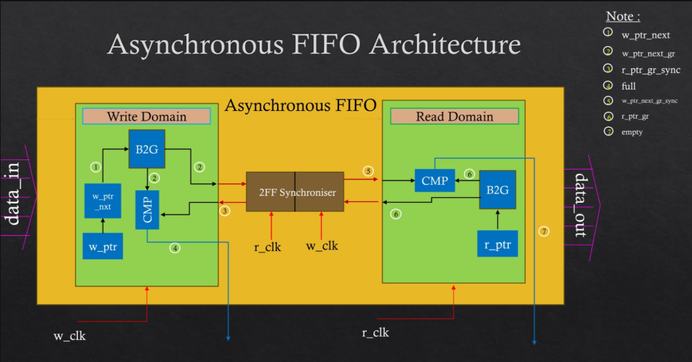
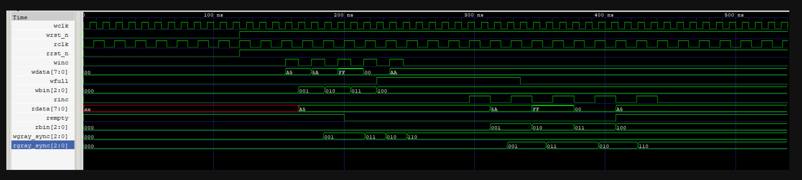
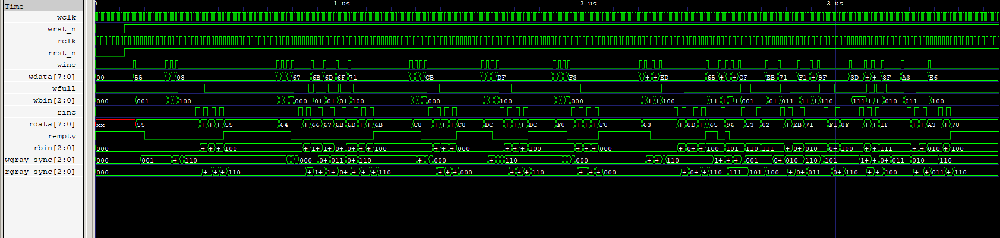

#  Asynchronous FIFO (CDC-Safe, Gray-Code Pointer Design)

A modular, parameterized asynchronous FIFO written in Verilog for safely transferring data
between two unrelated clock domains. Built around the industry-standard approach from Clifford
Cummings' SNUG papers: dual binary/Gray-code pointers, two-flop synchronizers, and pessimistic
full/empty flag generation.

---

##  Why This Exists — CDC & Metastability

When a signal crosses from one clock domain to another, sampling it on an unrelated clock edge
can catch it mid-transition, causing **metastability** — the flip-flop output briefly hovers
between 0 and 1 before resolving, and that bad value can propagate into the rest of the logic.

The standard fix is a **2-flip-flop synchronizer**: the first flop may go metastable, but it's
given a full clock period to resolve before the second flop samples it, making the output stable
with very high probability (MTBF). The `(* ASYNC_REG = "TRUE" *)` attribute tells FPGA/ASIC
placement tools to keep these two flops physically close together.

A single-bit signal is easy to synchronize this way — but a **multi-bit pointer** is not, because
multiple bits can change at once and the synchronizer might catch some bits before the transition
and others after, producing a completely wrong intermediate value. That's why FIFO pointers use
**Gray code**: only one bit ever changes per increment, so even mid-transition sampling produces
either the old or the new value — never garbage.

---

##  Design Approach

- **Dual binary + Gray pointer per side** — the binary pointer addresses memory directly (no
  decode logic in the critical path); the Gray pointer is the one that crosses clock domains.
- **Two-stage synchronizers** (`sync_2ff`) move each side's Gray pointer into the *other*
  domain before it's used for full/empty comparison.
- **Full/empty detection** uses one extra MSB beyond the address width to tell apart "pointers
  equal because empty" from "pointers equal because full (wrapped)":
  - `empty = (next read Gray pointer == synchronized write Gray pointer)`
  - `full = (next write Gray pointer == synchronized read Gray pointer with top two bits inverted)`
- Both flags are **registered outputs**, so they're asserted exactly on time but cleared a few
  cycles late (**pessimistic**) — safe, since it just delays the next operation rather than
  risking overflow/underflow.
- Memory is a simple dual-port array: synchronous write on `wclk`, combinational read on `rclk`.



---

##  Module List

| Module | Description |
|---|---|
| `sync_2ff` | Two-flip-flop CDC synchronizer with `ASYNC_REG` attribute |
| `fifo_mem` | Dual-port memory array (sync write, combinational read) |
| `write_ptr_ctrl` | Write-domain binary/Gray pointer + full-flag logic |
| `read_ptr_ctrl` | Read-domain binary/Gray pointer + empty-flag logic |
| `async_fifo` | Top module — wires all sub-blocks together |
| `tb_simple_async_fifo` | Minimal directed testbench (write-all-then-read-all) |
| `tb_async_fifo` | Full directed + randomized testbench (8 test sections) |
| `bin2gray` / `gray2bin` *(optional)* | Standalone binary↔Gray converters, not required in the main datapath since pointers are generated directly in Gray form |

**Parameters:** `DATA_WIDTH` (default 8), `ADDR_WIDTH` (default 2–4, FIFO depth = 2^ADDR_WIDTH).

---

##  How to Run

**Simple testbench** (depth-4 FIFO, write all 4 words, then read all 4 back):
```bash
iverilog -o fifo_simple sync_2ff.v fifo_mem.v write_ptr_ctrl.v read_ptr_ctrl.v async_fifo.v tb_simple_async_fifo.v
vvp fifo_simple
gtkwave simple_async_fifo.vcd
```

**Full testbench** (reset, fill, overflow, drain, underflow, simultaneous R/W, wraparound, 50 random ops):
```bash
iverilog -o fifo_full sync_2ff.v fifo_mem.v write_ptr_ctrl.v read_ptr_ctrl.v async_fifo.v tb_async_fifo.v
vvp fifo_full
gtkwave async_fifo_final.vcd
```

---

##  Testbenches

### 1. Simple Testbench — `tb_simple_async_fifo`
Writes 4 words (`0xA5, 0x5A, 0xFF, 0x00`) back to back, confirms `wfull` asserts on the 4th
write and blocks a 5th, then reads all 4 back and confirms `rempty` asserts after the last read
and blocks a 5th. No interleaving — purpose is just to sanity-check basic data flow and flag
behavior before moving to harder cases.



### 2. Full Testbench — `tb_async_fifo`
Eight sections, run in sequence:
1. Reset initialization check
2. Single write + empty-flag CDC delay check
3. Fill to full
4. Overflow blocking
5. Drain to empty
6. Underflow blocking
7. Simultaneous read/write interleaving (15 cycles)
8. Pointer wraparound (3 fill/drain cycles) + 50 randomized write/read operations

Each section prints a PASS/FAIL based on flag state, and internal pointer/Gray-sync values can
be dumped via a debug macro for CDC verification.



---

##  Known Limitations

- Full/empty flag clearing is intentionally delayed by a few cycles (pessimistic) — not a bug,
  but means back-to-back ops right at the boundary may stall slightly longer than necessary.
- No almost-full / almost-empty thresholds implemented.
- Memory is a register array, not yet mapped to vendor block RAM.
- Verification is print/flag based rather than a fully automated scoreboard with reference queues.

---

##  Future Improvements

- Add `almost_full` / `almost_empty` programmable threshold flags.
- Swap `fifo_mem` for vendor BRAM/SRAM macros for synthesis.
- Add a self-checking scoreboard (separate write/read reference queues) instead of manual
  PASS/FAIL flag inspection.
- Extend `sync_2ff` to a 3-stage synchronizer option for higher-MTBF/safety-critical use.
- Parameterize and test across multiple clock frequency ratios automatically.

---

##  Repo Structure

```
async_fifo/
├── sync_2ff.v
├── fifo_mem.v
├── write_ptr_ctrl.v
├── read_ptr_ctrl.v
├── async_fifo.v
├── bin2gray.v            (optional)
├── gray2bin.v            (optional)
├── tb_simple_async_fifo.v
├── tb_async_fifo.v
├── images/
│   ├── Architecture.png
│   ├── main_waveform.png
│   └── simple_waveform.png
└── README.md
```
